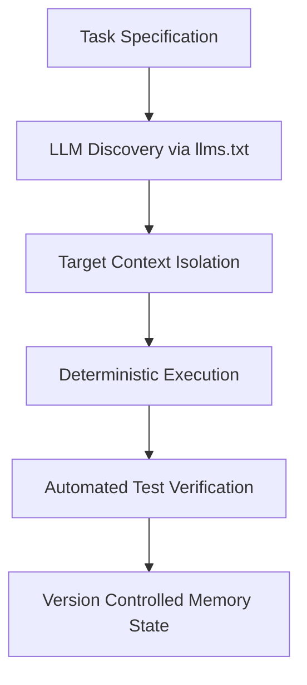

# Deep State of Mind (DSOM) Governance Framework

The **Deep State of Mind (DSOM)** protocol establishes persistent context governance, metacognitive project management, and Progressive Disclosure to minimise token consumption while maintaining deep architectural intent across AI sessions.

---

## 🏛 Core Principles of DSOM

1. **Living Brain in Palace**: Documentation is treated as a version-controlled operational state. Every file serves both human operators and autonomous AI context traversal.
2. **Progressive Disclosure**: Information is modularized into bite-sized, deterministic Markdown files so that AI context windows load only the exact quadrants required for execution.
3. **Minimal Sufficient Context**: AI runtimes ingest strictly necessary repository artifacts to execute discrete tasks, reducing context drift and eliminating hallucination.

---

## 🔄 Metacognitive Context Flow

---

## 🛡 Strategic Alignment

By coupling DSOM with Google Open Knowledge Format (OKF v0.2) frontmatter, document metadata is machine-parseable across multi-agent workflows (Jules, Google Antigravity, and CI sub-agents).
