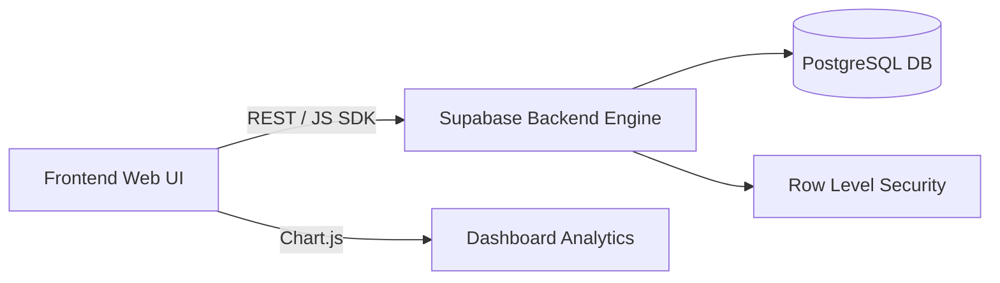

# System Architecture & Component Topology

Omni-View Business Command Centre is structured as a decoupled web application backed by Supabase PostgreSQL database service.

---

## 🏗 Subsystem Topologies

### Components:

- **Client Presentation Layer (`Web Ui/`, `js/`, `css/`)**: Static HTML5 interface enhanced with Bootstrap 5 and Chart.js. Client authentication guards enforce RBAC rules.
- **Backend Infrastructure Layer (Supabase)**: Houses core tables (`profiles`, `products`, `lives`, `payouts`) secured via PostgreSQL Row Level Security (RLS).
- **Automation & LLM Context Layer (`parse_llms_txt.py`)**: Utility pipeline generating XML context maps and sitemaps for AI systems.
